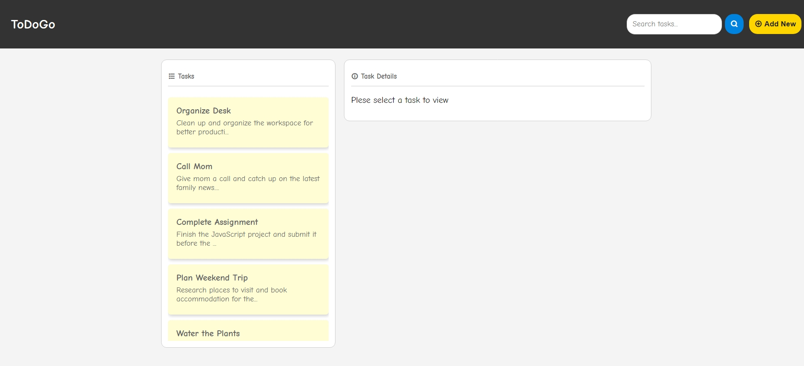
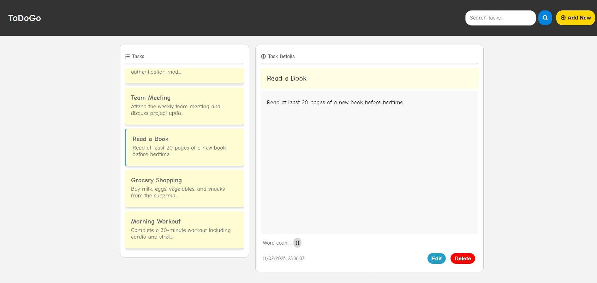
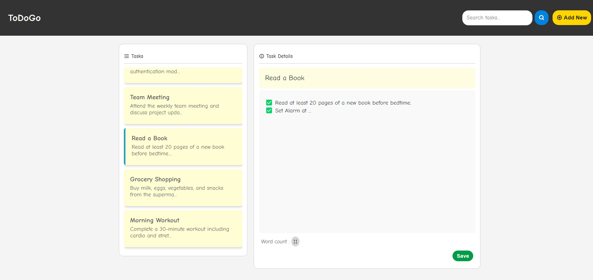
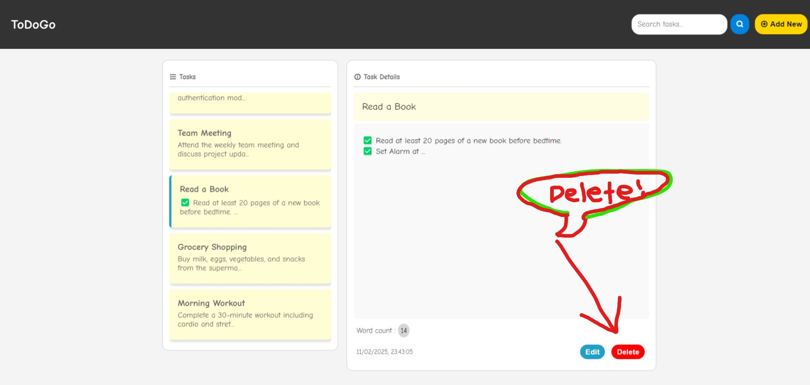

# ToDoGo - A Simple To-Do List App

ToDoGo is a lightweight and user-friendly To-Do List application built using **HTML, CSS, and JavaScript**. It utilizes the **localStorage** of the user's browser to store tasks, ensuring that tasks persist even after refreshing the page. The app is deployed on **GitHub Pages**.

## 🌟 Features

- 📌 **Add New Tasks** - Create new tasks easily.
- ✏ **Edit Tasks** - Modify existing tasks.
- ❌ **Delete Tasks** - Remove tasks when they are completed.
- 🔍 **Search Functionality** - Quickly find tasks using keywords.
- 🖥 **Persistent Storage** - Uses **localStorage** to save tasks session-wise in the browser.
- 🎨 **Clean and Responsive UI** - Designed for an intuitive and seamless user experience.

## 📸 Screenshots

1. **Homepage with Task List**
   
   

2. **Task Details View**
   
   

3. **Edit and Delete Options**
   
   

   
   

## 🚀 Live Demo

🔗 **[Try the App Here](https://rudrapankaj.github.io/JS_ToDoListApp/)**

## 🛠 Installation

To run the app locally, follow these steps:

1. **Clone the repository:**
   ```bash
   git clone https://github.com/rudrapankaj/JS_ToDoListApp.git
   ```
2. **Navigate to the project folder:**
   ```bash
   cd JS_ToDoListApp
   ```
3. **Open the `index.html` file in your browser.**

## 💂️ Project Structure

```
/JS_ToDoListApp
├── index.html        # Main HTML file
├── styles.css        # CSS for styling
├── script.js         # JavaScript logic
├── assets/           # Folder for images and icons
└── README.md         # Documentation
```

## 🎯 How It Works

1. Click the **"Add New"** button to create a new task.
2. Enter a title and task details.
3. Save the task, and it appears in the task list.
4. Click on a task to **view details**.
5. Use the **Edit** button to update task information.
6. Use the **Delete** button to remove a task.
7. Use the **Search bar** to find tasks quickly.

## 🛠 Technologies Used

- **HTML** - Structure
- **CSS** - Styling
- **JavaScript** - Functionality
- **LocalStorage** - Data storage in the browser

## 📝 License

This project is licensed under the **MIT License**.
